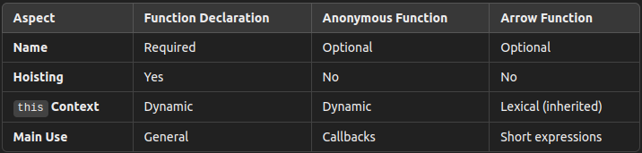

## Functions in JavaScript​: Declarations, Arrow Functions, and Anonymous Functions

Functions are one of the fundamental building blocks of programming in JavaScript. They allow you to encapsulate reusable logic and create modular programs. JavaScript provides various ways to declare and use functions, including function declarations, anonymous functions, and arrow functions. In this article, we'll explore each of them with practical examples.

<hr />

### 1. Function Declarations
A function declaration is defined using the function keyword, followed by a name, a set of parameters, and a code block.

#### Syntax:
```javascript
function functionName(param1, param2) {
    // Code block
    return result;
}
```

#### Example:
```javascript 
function sum(a, b) {
    return a + b;
}

console.log(sum(5, 3)); // Output: 8
```

#### Characteristics:
- **Hoisting:** Function declarations are "hoisted" to the top of their scope, meaning you can call them before they are defined in the code.
- **Reusable:** Can be called multiple times as needed.

<hr />

### 2. Anonymous Functions
Anonymous functions are functions that do not have a name. They are often used in expressions or assigned to variables.

#### Syntax:
```javascript
const variableName = function(param1, param2) {
    // Code block
    return result;
};
```

#### Example:
```javascript 
const multiply = function(a, b) {
    return a * b;
};

console.log(multiply(4, 2)); // Output: 8
```

#### Common Use:
Anonymous functions are widely used as callbacks for higher-order functions like **map**, **filter**, and **reduce**.
```javascript
const numbers = [1, 2, 3, 4];

const squares = numbers.map(function(number) {
    return number * number;
});

console.log(squares); // Output: [1, 4, 9, 16]
```

<hr />

### 3. Arrow Functions
Introduced in ES6, arrow functions provide a more concise syntax for writing functions. They use the => (arrow) operator and are often used for short function expressions.

#### Syntax:
```javascript
const variableName = (param1, param2) => {
    // Code block
    return result;
};
```
If the function body consists of a single expression, the return keyword can be omitted and the parentheses around a single parameter are optional.

#### Example:
```javascript 
const sum = (a, b) => a + b;
console.log(sum(5, 7)); // Output: 12
```
For functions without parameters, use ():
```javascript 
const message = () => 'Hello, world!';
console.log(message()); // Output: Hello, world!
```
#### Differences from Traditional Functions:
**No own this context:** Arrow functions inherit the value of this from the surrounding scope, which avoids issues when working with methods in objects or classes.
```javascript
function Car() {
    this.speed = 0;

    setInterval(() => {
        this.speed++;
        console.log(`Speed: ${this.speed}`);
    }, 1000);
}

new Car();
// The arrow function here ensures that `this` refers to the Car object.
```

<hr />

### 4. Differences Between Function Types



<hr />

### 5. When to Use Each Function Type?
- **Function Declarations:** Ideal for reusable functions defined in global or block scope. Use when hoisting is necessary.
- **Anonymous Functions:** Preferred for callbacks or temporary functions assigned to variables.
- **Arrow Functions:** Best for short functions and functions relying on lexical in this context. They are extensively used in functional programming.

<hr />

### Conclusion
Choosing the right type of function depends on the context and the desired functionality. Each approach has advantages, from the clarity and reusability of function declarations to the conciseness and flexibility of arrow functions. Understanding and applying the differences will help you write cleaner and more efficient JavaScript code.

Explore further, experiment with the different types, and see which one suits your needs best. 🚀

### References
- https://developer.mozilla.org/en-US/docs/Web/JavaScript/Guide/Functions

- https://developer.mozilla.org/en-US/docs/Learn/JavaScript/Building_blocks/Functions#anonymous_functions_and_arrow_functions