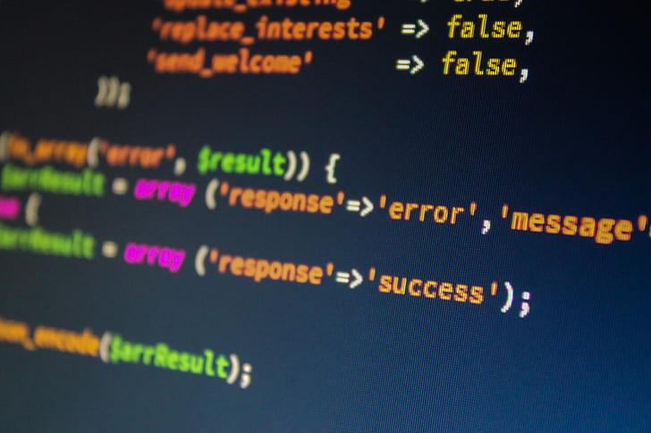

## Array and Object Manipulation in JavaScript​: map, filter, reduce, forEach, every, and some
avaScript provides an extensive toolkit for working with arrays and objects, allowing developers to write efficient, readable, and expressive code. Among the most powerful methods are **map()**, **filter()**, **reduce()**, **forEach()**, **every()**, and **some()**. Each serves a distinct purpose, enabling developers to transform, filter, and analyze data easily. This article will explore how these methods work and provide practical examples of their usage.

<hr />

### 1. Transforming Arrays with map()
The **map()** method creates a new array by applying a callback function to each element of an existing array.

#### Example: Converting Temperatures
```javascript 
const temperaturesCelsius = [0, 20, 30, 40];
const temperaturesFahrenheit = temperaturesCelsius.map(temp => temp * 9/5 + 32);

console.log(temperaturesFahrenheit); // Output: [32, 68, 86, 104]
```
Here, each Celsius temperature is converted to Fahrenheit, demonstrating how **map()** transforms data.

<hr />

### 2. Filtering Arrays with filter()
The **filter()** method creates a new array containing only the elements that satisfy a specific condition.

#### Example: Filtering Users by Age
```javascript 
const users = [
  { name: "Alice", age: 25 },
  { name: "Bob", age: 17 },
  { name: "Charlie", age: 19 }
];

const adults = users.filter(user => user.age >= 18);

console.log(adults); 
// Output: [{ name: "Alice", age: 25 }, { name: "Charlie", age: 19 }]
```
This example demonstrates how **filter()** extracts specific elements based on a condition.

<hr />

### 3. Reducing Data with reduce()
The **reduce()** method processes an array to produce a single value, such as a **sum**, **average**, or a **new object**.

#### Example: Totaling an Array
```javascript 
const prices = [10, 20, 30, 40];
const totalPrice = prices.reduce((acc, price) => acc + price, 0);

console.log(totalPrice); // Output: 100
```
Here, **reduce()** calculates the sum of all prices in the array.

<hr />

### 4. Iterating with forEach()
The **forEach()** method executes a callback for each element in an array. Unlike **map()**, it does not return a **new array**, making it ideal for side effects such as logging or updating variables.

#### Example: Logging Array Elements
```javascript 
const fruits = ["apple", "banana", "cherry"];
fruits.forEach(fruit => console.log(fruit));

// Output:
// apple
// banana
// cherry
```
While **forEach()** is less flexible for transformations, it’s excellent for operations like debugging or DOM updates.

<hr />

### 5. Checking All Elements with every()
The **every()** method tests whether all elements in an array meet a specified condition. It returns true if all elements satisfy the condition and false otherwise.

#### Example: Validating Scores
```javascript 
const scores = [80, 85, 90, 88];
const allAbove75 = scores.every(score => score > 75);

console.log(allAbove75); // Output: true
```
This method is ideal for validating datasets.

<hr />

### 6. Checking Any Element with some()
The **some()** method tests whether at least one element in an array meets a specified condition. It returns true if any element satisfies the condition and false otherwise.

#### Example: Checking for Discounted Items
```javascript 
const products = [
  { name: "Shirt", price: 50, discounted: false },
  { name: "Pants", price: 40, discounted: true },
  { name: "Hat", price: 20, discounted: false }
];

const hasDiscounts = products.some(product => product.discounted);

console.log(hasDiscounts); // Output: true
```
In this example, **some()** checks whether there are any discounted products.

<hr />

### 7. Combining Methods for Complex Tasks
By combining these methods, you can perform intricate operations with concise code.

#### Example: Filtering and Summing Prices
```javascript 
const items = [
  { name: "Book", price: 15 },
  { name: "Pen", price: 5 },
  { name: "Notebook", price: 20 }
];

const total = items
  .filter(item => item.price > 10) // Filter items with price > 10
  .map(item => item.price)        // Extract their prices
  .reduce((acc, price) => acc + price, 0); // Sum the prices

console.log(total); // Output: 35
```
This chaining approach simplifies complex data transformations.

<hr />

### 8. Working with Objects
You can adapt these methods for objects by leveraging **Object.keys()**, **Object.values()**, or **Object.entries()**.

#### Example: Transforming Object Values
```javascript 
const inventory = { apples: 10, bananas: 5, oranges: 8 };

const doubledInventory = Object.entries(inventory)
  .map(([fruit, quantity]) => [fruit, quantity * 2])
  .reduce((acc, [fruit, quantity]) => ({ ...acc, [fruit]: quantity }), {});

console.log(doubledInventory); 
// Output: { apples: 20, bananas: 10, oranges: 16 }
```
This chaining approach simplifies complex data transformations.

<hr />

### Conclusion
Understanding and effectively using array and object manipulation methods in JavaScript is crucial for writing efficient and maintainable code. Whether you're transforming data with **map()**, filtering it with **filter()**, reducing it with **reduce()** or validating conditions with **every()** and **some()**, these tools provide unparalleled flexibility. By mastering these methods and learning to combine them, you can tackle complex data processing tasks with confidence and elegance.